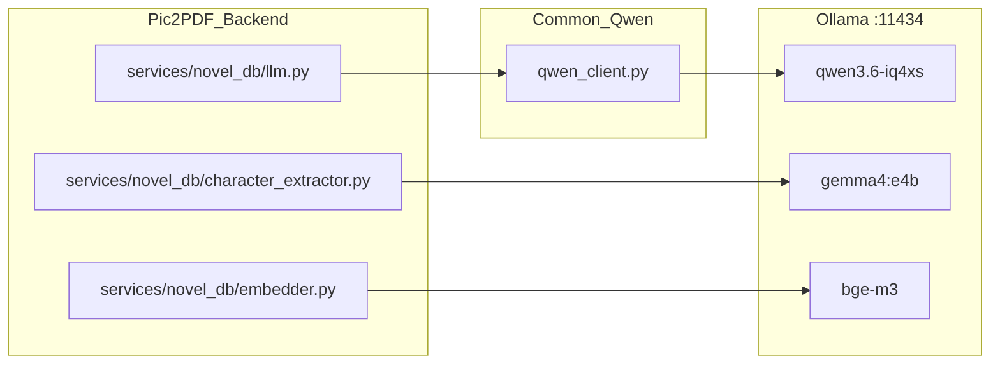
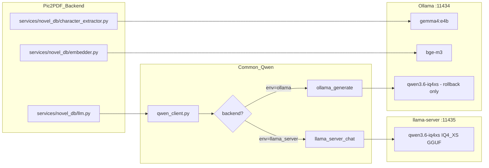

# 小説 RAG LLM バックエンド切替 設計案（ドラフト）

- **Status**: Draft（ADR-0009 採用後、本案を実装し本体設計書にマージする）
- **Date**: 2026-05-11
- **関連**: [ADR-0009](../02_基本設計/ADR/0009_llm-backend-llama-server.md) / [小説テキスト検索・RAG機能_バックエンド設計.md §7](小説テキスト検索・RAG機能_バックエンド設計.md) / [小説RAG_技術知見.md §9](../05_記録/小説RAG_技術知見.md)

## 1. 目的とスコープ

ADR-0009 で決定した「Qwen 推論バックエンドを Ollama から llama-server に切り替え」を実現するための具体的な実装案・運用案。

スコープ内:
- `qwen_client.py`（共通モジュール）の拡張
- `backend/services/novel_db/llm.py` の呼び出し方の変更
- llama-server の起動・常駐方式
- ロールバック手順・テスト計画

スコープ外:
- Ollama 撤去（Gemma / bge-m3 は引き続き Ollama を使う）
- 他プロジェクト（OCR 等）の Qwen 利用箇所（必要なら別 ADR で追従）

## 2. 構成図（Before / After）

### Before（現状: Ollama 一元）



### After（採用後: Qwen のみ llama-server）



## 3. qwen_client.py の拡張仕様

### 3.1 新規環境変数

| 変数名 | デフォルト | 用途 |
|---|---|---|
| `QWEN_BACKEND` | `llama_server` | `llama_server` / `ollama` を切替 |
| `QWEN_LLAMA_SERVER_BASE_URL` | `http://127.0.0.1:11435` | llama-server の base URL |

既存変数（`QWEN_OLLAMA_BASE_URL` / `QWEN_MODEL` / `QWEN_TIMEOUT_SEC`）はそのまま利用。

### 3.2 ディスパッチ関数

`stream_ask` / `astream_ask` の入口で `QWEN_BACKEND` を見て分岐:

```python
def stream_ask(prompt: str, *, ...) -> Iterator[dict]:
    backend = os.environ.get("QWEN_BACKEND", "llama_server")
    if backend == "llama_server":
        yield from _stream_ask_llama_server(prompt, ...)
    elif backend == "ollama":
        yield from _stream_ask_ollama(prompt, ...)
    else:
        raise QwenError(f"unknown QWEN_BACKEND: {backend}")
```

### 3.3 llama-server バックエンドの API 呼び出し

OpenAI 互換 `/v1/chat/completions` を使う。理由は `chat_template_kwargs` 経由で thinking 抑制ができるため（[ADR-0009 根拠 §thinking 抑制](../02_基本設計/ADR/0009_llm-backend-llama-server.md)）。

```python
def _stream_ask_llama_server(prompt, *, system, model, options, think, timeout, context):
    base_url = os.environ.get(
        "QWEN_LLAMA_SERVER_BASE_URL", "http://127.0.0.1:11435"
    )
    messages = []
    if system:
        messages.append({"role": "system", "content": system})
    messages.append({"role": "user", "content": prompt})

    body = {
        "model": model or _default_model(),  # llama-server は無視するが必須
        "messages": messages,
        "stream": True,
        "max_tokens": (options or {}).get("num_predict", 4096),
        "temperature": (options or {}).get("temperature", 0.2),
        "top_p": (options or {}).get("top_p"),
        "chat_template_kwargs": {
            "enable_thinking": False if (think is None) else bool(think),
        },
    }
    # ... POST + SSE 受信 + 既存 yield 形式 (response/done/...) に正規化
```

**正規化規約**: 既存呼び出し側（`backend/services/novel_db/llm.py:stream_qa` 等）は `event.get("response")` / `event.get("done")` / `event.get("prompt_eval_count")` 等を参照する。OpenAI 互換 SSE のフォーマット (`choices[].delta.content` / `finish_reason`) を Ollama 形式に変換するアダプタ層を `qwen_client.py` 内に閉じる。

### 3.4 `context` 引数の扱い

Ollama は `/api/generate` の `context` パラメータでセッション継続できるが、llama-server の OpenAI 互換 API は同等機能なし。代替として:
- 短期的: `context` 渡された場合は `QwenError("context resume is not supported with llama_server backend")` を投げる
- 長期的: 呼び出し側で `messages` を保持して再送する形に移行（現状の novel_db では未使用なので問題なし）

### 3.5 後方互換性

既存呼び出し側のシグネチャは変更しない。`think` / `options` / `timeout` の意味も維持。`QWEN_BACKEND=ollama` でロールバック可能。

## 4. backend/services/novel_db/llm.py の変更

### 4.1 変更点

- `os.environ.setdefault("QWEN_OLLAMA_BASE_URL", ...)` の上に **`QWEN_BACKEND` / `QWEN_LLAMA_SERVER_BASE_URL` の同期** を追加
- `LLM_OPTIONS` の `num_ctx` は llama-server では起動時パラメータで決まるため、ここで指定しても無視される旨をコメントに追記
- ロジック本体（`build_prompt` / `stream_qa`）は変更不要

### 4.2 config.py に追加

```python
# Qwen 推論バックエンド（'llama_server' or 'ollama'）
NOVEL_DB_LLM_BACKEND      = os.environ.get("NOVEL_DB_LLM_BACKEND", "llama_server")
NOVEL_DB_LLAMA_SERVER_URL = os.environ.get(
    "NOVEL_DB_LLAMA_SERVER_URL", "http://127.0.0.1:11435"
)
```

`llm.py` 側で `os.environ["QWEN_BACKEND"] = NOVEL_DB_LLM_BACKEND` / `os.environ["QWEN_LLAMA_SERVER_BASE_URL"] = NOVEL_DB_LLAMA_SERVER_URL` をブリッジする。

## 5. llama-server の起動・運用

### 5.1 起動コマンド（推奨設定）

```bat
@echo off
"D:\61.tool\common\llama.cpp\b9101\llama-server.exe" ^
  -m "D:\models\qwen3.6-35b-a3b-iq4_xs\Qwen_Qwen3.6-35B-A3B-IQ4_XS.gguf" ^
  -ncmoe 16 -t 9 ^
  -ctk q8_0 -ctv q8_0 ^
  -fa 1 ^
  -ngl 99 ^
  -c 18432 ^
  -np 1 ^
  --jinja ^
  --port 11435 --host 127.0.0.1
```

配置先: `D:\61.tool\common\llama.cpp\b9101\start-qwen-server.bat`

各オプションの意味:
- `-ncmoe 16`: 40 個の MoE block のうち 16 個を CPU、24 個を GPU に配置（[Phase 2a スイープで最適確認](../05_記録/小説RAG_技術知見.md)）
- `-t 9`: CPU スレッド数。本機 16 物理スレッドの 56%
- `-ctk q8_0 -ctv q8_0`: KV cache を 8bit 量子化（メモリ削減で MoE block を多く GPU に残す）
- `-fa 1`: Flash Attention
- `-c 18432`: max context size。num_ctx=16384 + α
- `-np 1`: 並列リクエスト数 1（**重要**: デフォルト 4 だと KV cache が分割されて性能 1/3 に低下する事象を検証中に確認）
- `--jinja`: chat template を有効化（`chat_template_kwargs` 受付に必須）

### 5.2 自動起動

Windows タスクスケジューラに「PC 起動時」トリガで `start-qwen-server.bat` を登録。

- 実行ユーザー: ローカルアカウント
- 実行レベル: 標準ユーザーで可（GPU アクセスのため管理者不要、要検証）
- 起動条件: 「ネットワーク接続を待つ」OFF（ローカルバインドのため）
- 失敗時の対応: タスクスケジューラの再試行で 30 秒後にリトライ × 3 回

### 5.3 ヘルスチェック

backend 起動時に llama-server `/health` を 1 回叩いて疎通確認。失敗時は `NOVEL_DB_LLM_BACKEND=ollama` にフォールバックするか、`/api/novel_db/health` のレスポンスに `llm_backend: "unhealthy"` を含める（フロントエンドで警告表示）。

### 5.4 Ollama との同時実行ガード

- Qwen3.6-IQ4_XS（llama-server）= VRAM 11.8 GiB
- Gemma 4:e4b（Ollama）= VRAM ~2.5 GiB
- bge-m3（Ollama）= VRAM ~1 GiB

合計 ~15 GiB > 本機 VRAM 12 GiB のため、**Gemma / bge-m3 の同時アクティブは VRAM 不足**になる可能性がある。Ollama は使用後 5 分でアンロードする設定（既定）で、シリアル利用なら問題なし。

主要登場人物抽出（Gemma 4:e4b 利用）と RAG QA（Qwen）を並列実行するシナリオは現状ないため、当面はガード不要。将来並列化したくなったら、`/api/ps`（Ollama）でモデルロード状況を見てキューイングする仕組みを追加検討。

## 6. ロールバック手順

採用後に問題が発生した場合の手順:

1. `.env` または環境変数で `NOVEL_DB_LLM_BACKEND=ollama` に設定
2. backend を再起動
3. Ollama 側の `qwen3.6-iq4xs` モデルが unload されていればロード（自動）
4. llama-server を停止（タスクスケジューラ無効化 + プロセス kill）

設定変更のみで戻せるよう、Ollama 側のモデル登録は撤去しない。

## 7. テスト計画

### 7.1 ユニット（pytest）

- `tests/services/novel_db/test_llm_backend.py` 新規
  - `QWEN_BACKEND=llama_server` 時の API 形式
  - `QWEN_BACKEND=ollama` 時の既存挙動を維持
  - `think=False` 時の `chat_template_kwargs` 送信確認（httpx 等で mock）
  - `context` 渡された時の `QwenError` 発生（llama_server 側）

### 7.2 統合（実 llama-server に対する手動確認）

検証用スクリプトは [tmp_bench_phase4_compare.py](../../tmp_bench_phase4_compare.py) を流用 / 改造。
- A_short / B_mid / C_long の応答品質を Ollama vs llama-server で再比較
- novel_db で書籍 1 冊を選び、scope=book / scope=all で 3 種類の質問を投げて応答時間と内容を記録
- 連続 10 回投げてメモリリーク / 応答劣化がないか確認

### 7.3 リグレッション

- 既存の `backend/tests/services/novel_db/test_llm.py`（あれば）が両バックエンドで通る
- 機能追加候補 B-13 段階 A（num_ctx=16384 切詰め解消）の挙動が維持されている

## 8. 既知の制約・未解決事項

1. **MTP 版 GGUF の効果は未検証**（[機能追加候補.md B-14b として保留](../01_要件定義/機能追加候補.md)）。Phase 3 を実施するなら別ベンチが必要
2. **CUDA 13.1 ドライバ依存**。NVIDIA ドライバを巻き戻すと llama.cpp が動かなくなるリスク。GPU 環境セットアップ.md に明記
3. **llama-server の Windows サービス化** は標準では存在しない。タスクスケジューラ + バッチが暫定解。NSSM 採用は別途検討
4. **常駐プロセスのメモリ管理**: 24 時間放置時の VRAM / RAM 使用量推移は採用後 1 週間で実機確認したい
5. **llama.cpp のバージョン固定**: 現在 b9101。新版で `-ncmoe` 等のオプション仕様が変わる可能性。アップデートはベンチを通してから

## 9. 採用後のドキュメント更新

採用が確定したら以下を更新:
- 本ドラフトを [小説テキスト検索・RAG機能_バックエンド設計.md §7](小説テキスト検索・RAG機能_バックエンド設計.md) にマージし、本ファイルは削除
- [アーキテクチャ詳細_バックエンド編.md](アーキテクチャ詳細_バックエンド編.md) の推論バックエンド構成図を After 図に置換
- [GPU環境セットアップ.md](../04_環境構築/GPU環境セットアップ.md) に llama.cpp 入手手順を追加
- [機能追加候補.md](../01_要件定義/機能追加候補.md) の B-14 を「完了」に
- ADR-0009 の Status を `Accepted` に
