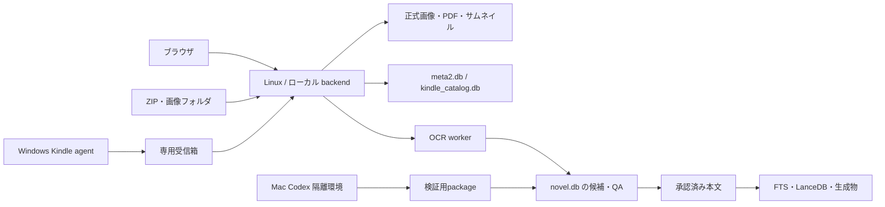

# 基本設計書

> status: living | last-verified: 2026-09-05

本書は主要プロセス・データストア・連携境界を定義する。
利用者から見た挙動は[要件定義書](../要件定義/要件定義書.md)、
状態遷移と失敗時の条件は各機能の詳細設計が所有する。

## 1. アーキテクチャ設計

### 1.1. 層と主要技術

| 層 | 責務・技術 | 詳細 |
|---|---|---|
| ブラウザ | React / TypeScript / Vite / TailwindCSS。Queryによるサーバー状態管理、画像とreact-pdfによる閲覧 | [フロントエンド設計](../詳細設計/詳細設計書_フロントエンド編.md) |
| Web backend | FastAPI / uvicorn。ルーターはHTTP、サービスは処理・保存境界を担当 | [バックエンド設計](../詳細設計/詳細設計書_バックエンド編.md) |
| Kindle Windows agent | 起動済みKindleのUI識別・操作・撮影、一時成果物の転送 | [自動撮影ジョブ契約](../詳細設計/機能別/Kindle自動撮影ジョブ契約.md) |
| OCR worker | ページごとのOCR候補と実行証跡を作成し、QA待ちrunへ保存 | [OCR設計書](../詳細設計/機能別/OCR設計書.md) |
| LLM・検索 | bge-m3でembedding、Qwenで生成・QA。共通LLMクライアントから接続 | [小説RAGデータ設計](../詳細設計/機能別/小説RAG_データ.md) |

Pythonはbackend / kindle-pdf / common/llmのuv workspaceで管理する。
source、ポート、配信構成は[共通設計](../詳細設計/詳細設計書_共通.md)を参照する。

### 1.2. データとプロセスの境界

候補保存、QA、正式公開を別境界にする。受信箱や隔離環境の成果物を直接正式本文として扱わない。

| 保存先 | 所有するデータ |
|---|---|
| `meta2.db` | source別の書誌メタデータ、表示設定、閲覧状態 |
| `kindle_catalog.db` | 購入情報、画像紐付けの参照元、capture jobと画像QA監査 |
| `novel.db` | OCR候補・QA・承認済み本文、生成物、検索の正本データ |
| LanceDB | 本文から作るベクトル・検索索引。正本本文との整合を検証する |
| 画像領域 | source別の正式画像・PDF・サムネイル。小説本文とは別保存 |

DB schemaはmigrationと実装、API一覧と型はOpenAPIを最上位とする。
手書きの説明範囲は[API設計](../詳細設計/API.md)を参照する。

## 2. 主要データフロー

### 2.1. 同人誌の取り込み

利用者が入力共有へZIP・フォルダを置き、backendの監視処理がコピー完了を確認して取り込む。
手動スキャンも同じ処理・排他境界を使う。成功分は閲覧用画像・サムネイルとし、入力を完了領域へ移す。
隠しディレクトリのKindle専用受信箱は同人誌監視から除外する。

監視、再試行、ジョブ進捗の詳細は[バックエンド設計](../詳細設計/詳細設計書_バックエンド編.md)。

### 2.2. 一覧・閲覧・メタデータ

backendがsource別の書籍一覧とメタデータを返し、ブラウザは静的配信から画像・PDFを取得する。
閲覧状態・作者・シリーズ等の共有状態はサーバーへ、テーマ等の端末固有設定はブラウザへ保存する。
URLで選択書籍と現在地を再現し、利用者が確定した編集だけを保存する。

描画・ページ操作・キャッシュの詳細は[ライブラリ・リーダーUI設計](../詳細設計/機能別/ライブラリ・リーダーUI設計.md)。

### 2.3. Kindle自動撮影

購入カタログから1冊分のjobを作成し、Windows agentが対象を照合して撮影する。
成果物は専用受信箱を経由し、Linux backendが独立検証してから正式画像・メタ情報・jobを確定する。
シリーズ実行も1冊の登録成功を確認して次へ進み、途中成果物を正式配置しない。

状態・排他・heartbeat・manifest・補償は[自動撮影ジョブ契約](../詳細設計/機能別/Kindle自動撮影ジョブ契約.md)、
Windows内部のUI操作は[kindle-pdf詳細設計](../../../kindle-pdf/docs/detailed_design.md)を参照する。

### 2.4. 小説OCR・RAG構築

管理画面の非同期ジョブでOCR候補を保存し、QA・承認後だけ1冊分を公開する。
MacのCodex管理OCRは隔離環境で原画像確認・補正を行い、検証済みpackageをLinuxへ取り込む。
取り込みと公開は別操作であり、Macから本番DBを直接更新しない。

公開本文からチャンク・embeddingを作り、Qwenで要約・人物辞典を生成する。
Contextual Retrieval用の文脈生成と人物関係生成は別ジョブとして扱う。
検索はFTS5とベクトル検索を組み合わせる。ICUのshadow観測・切替条件は検索QA設計が所有する。

- [OCR・QA・公開契約](../詳細設計/機能別/OCR設計書.md)
- [構築パイプライン](../詳細設計/機能別/小説RAG_パイプライン設計.md) / [検索QA](../詳細設計/機能別/小説RAG_検索QA設計.md)
- [Sol隔離生成の契約](../詳細設計/機能別/小説RAG_Sol生成・評価設計.md) / [未完了の導入計画](../../log/計画/Sol生成・評価_導入計画.md)

SolによるFull Build置換・本番取り込みは未実装であり、現在のQwen構築経路と混同しない。

### 2.5. Kindle購入情報

Amazonエクスポートを固定入力領域へ配置し、backendが専用DBへ冪等に取り込む。
既存画像とのASIN紐付けは候補を利用者が確認して確定する。旧アプリの画像や表紙は移行しない。
詳細は[購入カタログ設計](../詳細設計/機能別/Kindle購入カタログ設計.md)。

### 2.6. 外部観測・端末連携

Kindle価格監視はCodexのブラウザ観測を履歴・通知へ接続し、取得不能時に推測値を保存しない。
hitomi新着監視は独立スクリプトから検出履歴を保存する。
Codex端末間連携は専用メールボックスを介し、本文や本番DB更新の代替経路にしない。

詳細は[Kindle価格監視](../詳細設計/機能別/Kindle価格監視設計.md)、
[hitomi新着監視](../詳細設計/機能別/hitomi新着監視設計書.md)、
[Codex端末間連携](../詳細設計/機能別/Codex端末間連携設計.md)を参照する。

## 3. 設計判断と運用

採用理由は[ADR一覧](ADR/README.md)、信頼境界は[セキュリティ設計](../詳細設計/セキュリティ設計書.md)、
配備・バックアップ・復旧は[運用ガイド](../環境構築/運用ガイド.md)を参照する。
