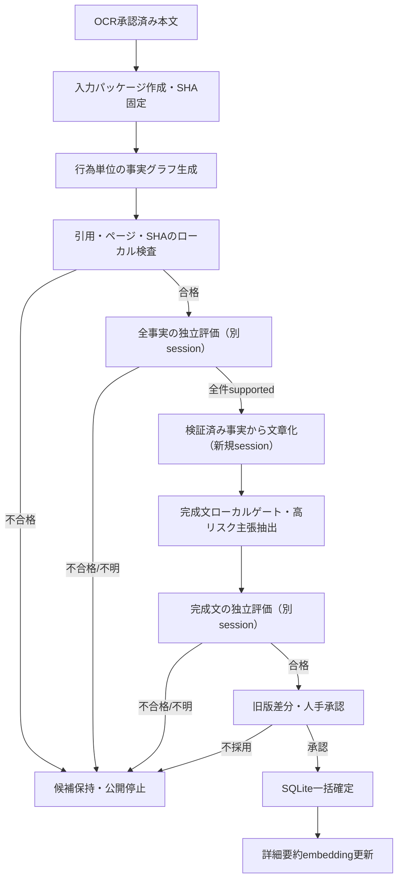

# 小説 RAG Sol 主生成・選択的独立評価設計

> status: living | last-verified: 2026-09-05

OCR確定後の書籍事実、詳細あらすじ、一覧用短縮要約、人物辞典をGPT-5.6 Solで生成し、
高リスク主張だけを別の新規Solセッションで原文照合する品質優先経路を定義する。
実装前の目標設計であり、現行Qwen経路と公開DBの既定動作はまだ変更しない。

関連:

- [ADR-0018](../../基本設計/ADR/0018_sol-primary-post-ocr-generation.md)
- [小説RAG パイプライン設計](小説RAG_パイプライン設計.md)
- [小説RAG データ設計](小説RAG_データ.md)
- [セキュリティ設計書](../セキュリティ設計書.md)
- [バックログ B-36](../../../log/計画/バックログ.md)
- [Codex 非対話実行](https://learn.chatgpt.com/docs/non-interactive-mode)
- [Codex 認証](https://learn.chatgpt.com/docs/auth)

---

## 1. 目的と対象範囲

### 1.1 目的

- ローカルLLMのモデル切替、長時間推論、相関した自己検証、手動救済を減らす。
- 事実抽出から公開候補の執筆までをSolへまとめ、巻全体の因果、主体、時系列、最終状態を優先する。
- 独立評価は誤りの影響が大きい主張だけへ限定し、サブスクリプション利用量を抑える。
- 既存公開版を保持したまま候補を評価し、合格・人手承認後だけ一括確定する。

### 1.2 対象

- OCR承認済み`pages.index_eligible=1`本文からの構造化事実抽出
- `books.summary`用の詳細あらすじ
- `books.catalog_summary`用の400〜700文字要約
- `book_characters`用の人物辞典
- 上記完成文に含まれる高リスク主張の独立評価

### 1.3 対象外

- OCRそのもの。画像は既存Surya OCR 2経路でローカル処理する。
- bge-m3 embedding、FTS5、検索インデックス。
- 対話型RAG QA、Query Expansion、チャンク文脈生成、関係グラフ生成。
- APIキー課金によるOpenAI Responses API統合。必要になった場合は別設計・別承認とする。
- Solによる公開DBへの直接書込み、Git操作、外部検索、画像・PDFの送信。

---

## 2. 基本方針

1. **事実検証と文章化を分離**: Solは最初に行為単位の事実グラフだけを生成し、別sessionの
   独立評価で全件supportedとなった事実だけを、後続の1回の文章化で詳細版、一覧版、人物辞典、
   高リスク主張台帳へ変換する。全文から事実抽出と完成文を同時生成しない。
2. **1冊1新規セッション**: 別書籍や過去の試行を引き継がない`codex exec --ephemeral`を使用する。
   Compactまたは会話要約を証拠・状態・再開点として使わない。
3. **原文正本**: 生成セッションへ渡す証拠はOCR確定本文、正規名台帳、状態契約だけとする。
   旧要約、Qwen事実表、Luna出力、後続巻情報を混ぜない。
4. **決定的検査はローカル**: SHA-256、JSON Schema、ページ範囲、文字数、正規名、禁止表記、
   参照整合、公開版差分はモデルに判定させない。
5. **意味評価は選択的に独立**: 高リスク主張だけを別の新規Solセッションへ渡す。
   主生成の会話履歴・理由・事実表全体は渡さず、対象主張と原文ページ窓だけで判定させる。
6. **fail closed**: Schema不正、原文ハッシュ不一致、重大主張の不合格、重要事実欠落、
   人手未承認のいずれかがあれば公開しない。
7. **Qwenは撤去しない**: 対話QAとオフライン・利用上限時の手動代替として維持する。
   Sol失敗時に自動でQwen候補を公開するフォールバックは行わない。

---

## 3. 実行境界

### 3.1 サブスクリプション経路

初期版はMac上のCodex CLIをChatGPTログインで使用する。`codex exec`は保存済みCLI認証を再利用し、
ChatGPTログイン時はサブスクリプション側の利用上限、APIキーログイン時はOpenAI Platformの
従量課金になる。実行前に`codex login status`で認証種別を確認し、`auth_mode=chatgpt`以外なら
ジョブを開始しない。子プロセスから`OPENAI_API_KEY`と`CODEX_API_KEY`を除去し、API経路への
意図しない切替を防ぐ。API経路への自動切替はしない。

### 3.2 実行ホスト

- Sol runnerはChatGPTログイン済みのMacで実行する。
- Linuxサーバーへ`~/.codex/auth.json`をコピーしない。認証キャッシュをGit、ジョブ成果物、ログへ含めない。
- 認証保存は可能な場合`cli_auth_credentials_store="keyring"`を使用する。
- Linux上の本番`novel.db`をSolが直接開かない。OCR本文を含む入力パッケージを明示的にexportし、
  Tailscale内のSSH/SCP等の保護された経路でMacへ転送する。
- 結果import時はbook IDではなく、書名、ページ集合、OCR本文SHA-256をサーバー側で再照合する。
- OCR本文を含む書籍別隔離ディレクトリは所有者のみ`0700`、入力・出力・event logは`0600`とし、
  一時ファイルからの原子的置換後もmodeを維持する。監査終了後の保持・削除は人手承認結果とともに行う。

### 3.3 Codex実行プロファイル

```text
model: gpt-5.6-sol
reasoning: mediumを基準に固定コーパスでhighと比較し、合格する最小値を採用
session: ephemeral / 1 book / fresh context
sandbox: read-only
working root: Gitリポジトリ外の書籍別隔離ディレクトリ
user config: --ignore-user-config
exec policy: --ignore-rules
network/external knowledge: 不使用
input: stdinの状態契約 + 名前・文字数・SHA付きで一度だけ封入したOCR本文
output: JSON Schema準拠ファイル + JSONLイベントログ
```

隔離ディレクトリには出力Schemaと実行指示だけを置き、`--skip-git-repo-check`を使う。本文、fact graph、
評価対象はrunnerがstdinへdata sectionとして一度だけ封入し、sandbox内のファイルとしては公開しない。
モデルがshellで同じ長文を反復読込して入力tokenを増幅できないようにする。
これによりアプリ本体の`AGENTS.md`やコードを入力へ混ぜず、MCP・Web検索・Git・外部コマンドを
必要としない単目的実行にする。モデル推論に必要なOpenAI通信まで無効化する意味ではない。

`codex exec --json`の`turn.completed.usage`から入力、キャッシュ入力、出力、推論トークンを監査保存する。
最終成果は`--output-schema`と`--output-last-message`でJSONへ固定する。実装時はCLIの実機バージョンで
使用可能なフラグを確認し、非対応フラグを推測で代替しない。

---

## 4. 全体フロー



主生成と評価を同じセッションで継続しない。評価セッションは候補を弁護・補完する編集役ではなく、
原文と候補主張の矛盾、未支持、重要な限定条件の欠落を判定するだけとする。

### 4.1 検証済み事実グラフ

`sol-fact-graph-v1`は1 factを1つの中心行為または1つの状態遷移へ限定する。各factは一意なID、
主体、行為、対象、行為者の役割、時制、確定度、途中状態、最終状態、根拠ページ、原文からの
20〜120文字の完全一致引用を持つ。準備、承認、物理的実行、対象を1 factへ混在させず、同じ出来事でも
役割または時点が異なる場合は分割して参照関係を持たせる。

`sol-fact-graph-v2` 実験promptはSchema形状と`schema_version: sol-fact-graph-v1`を維持しつつ、
初回3冊の意味不一致6件を汎用的な生成契約へ反映する。各actor role、行為、対象、時制、
`state_before / state_after`は、根拠引用集合が直接支持する場合だけ確定する。

- 作中人物の発言・疑い・予測は「発言した」「信じた」factとし、後段で否定される世界の
  確定事実へ変換しない。後段の訂正・真相・最終状態は別factとする。
- 到着時刻、経路、結果から意図・故意・因果を補わない。予定、条件、意向を完了済み行為にしない。
- 当該時点の実際の身分・役割を使い、将来志望、旧職、別名義で置き換えない。
- `tactical_planner`は策を立案した人物、`physical_actor`は中心行為を実行した人物に限る。
  他者の計画に従った説得者・伝令者を立案者にしない。
- `witness`は中心行為を実際に知覚した人物に限る。同じ場所にいるだけ、対話相手、
  行為者に気づいていない人物、席を外した人物は`witness`にしない。

ローカル検査はsource SHA、fact ID、page集合、引用の完全一致、引用長、列挙値、参照整合を確認する。
引用が原文へ存在しない候補は意味が妥当そうでも拒否する。固定評価ケースの期待値、旧要約、既存事実表、
人物辞典は事実生成sessionへ渡さない。

`related_fact_ids`だけは、`F42`に対して既存IDが`F042`の1件だけ存在するようなゼロ埋め差を
ローカルで決定的に正規化してからdigestを付与する。数値同値の候補が0件または複数件、非数値ID、
fact本体や根拠の変更は自動補正せず拒否する。

別の新規Sol sessionは候補factと根拠ページ窓だけを受け、`supported / contradicted / unsupported`を返す。
全factを欠落・重複なく評価し、review側の根拠引用も原文へ完全一致する場合だけ検証済み事実グラフとする。
不合格factの自動削除や言い換えで通過させず、候補全体を保持して停止する。

---

## 5. 入力パッケージ

### 5.1 `manifest.json`

```json
{
  "schema_version": "sol-input-v1",
  "run_id": "uuid",
  "book_name": "書名",
  "source_sha256": "sha256",
  "page_count": 77,
  "page_start": 8,
  "page_end": 84,
  "canonical_names": ["正規名"],
  "prompt_version": "sol-publication-v1",
  "privacy_acknowledged_at": "ISO-8601",
  "allowed_outputs": ["facts", "detailed", "catalog", "characters", "risk_claims"]
}
```

### 5.2 `pages.jsonl`

- 1行1ページで`page_no`、`full_text`、`char_count`を持つ。
- `index_eligible=1`だけをページ順に出力する。
- SHA-256はページ番号、区切り、本文を含む正規化済みバイト列から計算する。
- 実行前に入力文字数とSchema・出力予約量を検査する。対象Codex CLIとモデルで安全に扱える上限を
  実測して設定し、超過時は`input_too_large`で停止する。末尾切捨てや暗黙のページ除外は行わない。
- 書籍画像、PDF、ASIN、ローカル絶対パス、DB接続情報、旧生成物を含めない。
- タイトル等の非本文ページは送信しない。ただし本文理解に不可欠と人手指定されたページは、
  `manual_include_reason`付きで明示的に追加できる。

### 5.3 状態契約

プロンプト本文ではなくJSONを正本にし、目的、現在工程、禁止事項、完了条件、正規名、列挙値を持たせる。
固定評価ケースの**期待する答え**は主生成へ渡さず、ローカル検査と独立評価だけが参照する別fixtureへ置く。
期待値を主生成へ教えると、原文より細かい役割分担まで候補へ転写され、独立評価で不合格となるためである。
セッション再開やCompactで状態を復元せず、失敗時は元の入力パッケージから新規セッションを開始する。

---

## 6. 文章化出力契約

独立評価済みの`sol-fact-graph-v1`だけを入力にし、本文ページは文章化sessionへ渡さない。
出力Schemaは`sol-publication-v1`とし、少なくとも次を含む。

| フィールド | 内容 |
|---|---|
| `source_sha256` | 入力manifestと完全一致する本文ハッシュ |
| `detailed_summary` | 中心人物、発端、因果、対立、転機、結果、関係変化、巻の意味を含む詳細版 |
| `catalog_summary` | 400〜700文字で独立して理解できる一覧版 |
| `characters[]` | 正規名、根拠fact ID、人物説明。根拠がない人物は出力しない |
| `claims[]` | 完成文の各文を一字一句保持し、出現先と根拠fact IDを対応付ける台帳 |
| `unresolved[]` | 原文だけでは確定できない事項。完成文で断定しない |

事実グラフの事実本文は原文の長い転載ではなく要約とし、各事実に根拠ページを必須とする。主体役割は
`tactical_planners[] / command_approvers[] / physical_actors[] / targets[] / witnesses[] / decision_makers[]`に
分け、各要素へ名前、根拠ページ、`fact/inference/unknown`を持たせる。単一の文字列へ複数人物を連結せず、
明示根拠がない役割は空配列にする。
`physical_actors[]`は当該factの中心行為を実際に行った人物だけに限定する。1件のfactへ準備、偽装、拘束、逃走など
複数の行為が混在して役割を一意に対応できない場合はfactを分割し、関与人物をまとめて実行者へ入れない。
期間、数量、可能性には`up_to / at_least / exact / estimated / unknown`を明示し、
「最長10年」を「10年」へ変えるような限定条件の消失を機械比較できるようにする。

`claims[]`は詳細版、一覧版、各人物説明を句点・疑問符・感嘆符単位に完全被覆する。同じ文を複数箇所で
使う場合も出現先ごとに別claim IDを持ち、各claimは1件以上の既存fact IDだけを参照する。ローカル検査で
未登録文、artifact textとの不一致、未知fact ID、重複claim IDを拒否する。

---

## 7. ローカル決定的ゲート

次をモデル呼び出しなしで検査する。

- JSON Schema、必須フィールド、列挙値、ID一意性、参照整合
- `source_sha256`、ページ範囲、冒頭・中盤・末尾の根拠網羅
- 全fact・人物に1件以上の許可ページがあること
- 詳細版、一覧版、人物説明への生成マーカー、コードフェンス、ページ記号の漏出
- 一覧版400〜700文字、空出力、重複文・重複段落
- 完成文の全sentenceが`claims[]`へ一対一対応し、各claimが検証済みfact IDを1件以上参照すること
- 正規名台帳にない表記、正規化されていない中国字、既知のOCR置換ノイズ
- `up_to / at_least / unknown`等の限定条件が完成文で強い断定へ変わっていないこと
- 「最長」「長くても」「長くて」等の表層一致ではなく、正規化した限定意味と値で判定すること
- 途中状態と最終状態が異なる固定ケースでは、別factとして保持し、遷移または矛盾関係を参照できること
- 戦術立案、指揮・承認、物理的実行、対象が事実表と完成文で入れ替わっていないこと
- 一覧版が高リスク事件の限定期間と物理的実行者を、意味が変わる形で省略・置換していないこと
- 公開版と候補の全文差分、人物集合の理由なき削除

ローカルゲート不合格は、該当fact、影響する完成文、根拠ページ窓、エラー一覧だけを新規Sol highへ渡す
限定修正を1回許可する。修正出力は対象fact、対象risk claim、既存文への完全一致置換だけとし、ローカル側で
基準候補ハッシュ、Schema、変更許可範囲、fact IDと参照更新を検証してから適用する。全文再生成、修正対象外の
言い換え、2回目の修正は行わない。適用後に候補全体のローカルゲートを最初から再実行し、合格時だけ独立評価へ進む。

---

## 8. 高リスク主張の抽出と独立評価

### 8.1 高リスク分類

- 死亡、生存、拘束、解放、離脱、帰還、裏切り、逮捕、投獄
- 「しない」「できない」「未確定」等の否定・未確定性
- 一時的な発言と最終決定が異なる状態
- `最長`、`最低`、`約`、`可能性`、`予定`等の限定条件
- 主語、代名詞、計画者、実行者、対象者が異なる主張
- 政治・外交上の方針と、実際に完了した結果の区別
- 人物関係・心理の不可逆な変化を断定する主張

文章化出力の`claims`からローカル規則で高リスク部分集合を抽出する。モデルが高リスク表現を
申告しなかった場合でもローカル規則で拾う。評価対象の`artifact_text`は詳細版・一覧版・人物説明から
一字一句そのまま抽出し、出現先、開始位置、文ハッシュを持たせる。評価用の正規化主張は別フィールドとし、
言い換えた主張だけを監査対象にしない。ローカル規則が抽出した全高リスク文がいずれかのclaimへ完全一致で
対応し、同じ完成文の時制・主体・限定条件を評価入力へ渡せることを独立評価の前提とする。
抽出規則の版とハッシュをmanifestへ記録する。「完全被覆」はその規則が抽出した文集合に対する完全性であり、
未知の表現を含む全意味リスクの完全性とはみなさない。固定コーパスで語彙と規則を継続拡張する。

### 8.2 評価入力

各主張へ、完成物から完全一致抽出した`artifact_text`、評価用の正規化主張、OCR原文の候補ページと前後1ページを
付ける。同じ出来事の途中状態と
最終状態が離れている場合は両方を提示する。評価入力は主張ID、出現先、分類、主張文、候補ページに限定し、
主生成が予測した役割・限定条件は渡さない。評価セッションには書籍全体、主生成の理由、旧要約を渡さない。
候補ページ対応を信頼できないパイロットでは、監査漏れを避けるため確定OCR全文を渡してよい。その場合も
候補事実表、生成・修正理由、前回レビュー、固定fixtureは渡さず、入力本文ハッシュを記録する。

### 8.3 評価出力

各主張を`supported / contradicted / unsupported`で判定し、根拠ページ、主体3役、時系列、
限定条件、短い理由を返す。全高リスク主張が`supported`で、重要な限定条件欠落がない場合だけ合格する。
正規化主張と`artifact_text`の判定が異なる場合は、公開される`artifact_text`の判定を正本とする。
評価結果で候補本文を自動編集しない。不合格時は候補を保持し、人手確認または主生成の1回再実行を選ぶ。

### 8.4 E18単一修正と41件再評価の監査契約

10巻r6候補のE18は、別承認の修正cycleとして他の40件と分離する。ローカル監査器は
基準candidate SHA、OCR本文SHA、修正対象claim ID、変更前の完全一致文・位置・文SHA、
変更後文、修正run IDを入力とし、E18の完全一致置換だけを許可する。E18以外のartifact、
人物集合、事実表、一覧版を1 byteでも変更した候補は拒否する。修正案の意味的妥当性は
ローカル文字列検査だけで合格にせず、人手承認と新規Sol評価を必要とする。

修正適用後は同じ版の決定的抽出器で全artifactから41件を再抽出し、出現先、開始・終了位置、
artifact SHA、完全一致文、文SHAの内部整合を検査する。独立評価結果はcandidate SHA、
source SHA、抽出器version・digest、review run ID、41件すべてのclaim IDと完全一致文SHAを要求する。
修正runと同じrun ID、欠落・重複claim、`supported`以外、重大な限定条件欠落が1件でもあれば
fail closedとする。検証器は候補・review JSONだけを読み、公開DBを変更しない。

公開確定は41件全件supported、ローカルゲート合格、旧版差分確認、人手承認後の別工程である。
新規独立セッションを実行できない環境では、修正候補とreview入力までを保存して
`awaiting_review`で停止し、同一セッションの自己判定で代替しない。

---

## 9. ジョブ状態と成果物

### 9.1 状態

```text
prepared
  -> input_too_large | generating
  -> local_gate_failed | awaiting_review | paused_quota | failed
local_gate_failed
  -> repairing | rejected
repairing
  -> local_gate_failed | awaiting_review | paused_quota | failed
awaiting_review
  -> reviewing
  -> review_failed | awaiting_approval | paused_quota | failed
awaiting_approval
  -> published | rejected
```

利用上限、再ログイン要求、一時的なCodex障害は`paused_quota`として通常の品質不合格と区別する。
自動リトライせず、同じ入力ハッシュのチェックポイントから人手で再開する。
`input_too_large`は本文を黙って縮めず、固定パイロット外の階層化設計が必要であることを示す終端状態とする。

### 9.2 staging構成案

```text
sol_runs/<run_id>/
├── manifest.json
├── pages.jsonl
├── candidate.json
├── local-gate.json
├── repair-input.json
├── repair.json
├── repair-apply.json
├── repaired-candidate.json
├── risk-input.json
├── review.json
├── usage.json
├── stderr.log
└── approval.json
```

入力OCRは成功・不採用後の既定7日で削除し、manifest、ハッシュ、候補、検査結果、使用量、承認記録を保持する。
保持期間は実装時に設定化する。`stderr.log`はトークン、絶対パス、本文断片を含み得るため外部転送しない。

---

## 10. 公開確定

- SolはSQLiteへ接続しない。
- 詳細版、一覧版、人物辞典、監査結果をメモリまたはstagingで完成させる。
- ローカルゲート、独立評価、人手承認がすべて合格した場合だけ、既存の一括確定処理を呼ぶ。
- `books.summary`、`books.catalog_summary`、`book_characters`を単一SQLiteトランザクションで置換する。
- 不合格・中断時は既存公開版を維持する。
- コミット後に詳細要約embeddingを更新し、失敗時はSQLiteを正本として再index待ちにする。

Phase 1では自動公開を禁止し、必ず旧版差分と成果物全文を人手確認する。自動公開の検討は
固定コーパスで重大誤り0件を継続してから別途決定する。

---

## 11. 利用量・再試行ガード

- 主生成は1冊1回、形式修正は最大1回、独立評価は高リスク主張の束ごとに最大1回とする。
- 同じ失敗理由でモデルを再試行し続けない。
- 複数冊のSol主生成を並列実行しない。夜間バッチも直列とする。
- 利用上限到達時は`paused_quota`で停止し、APIキーへ自動切替しない。
- 既存成果物が同じ`source_sha256`、モデル、プロンプト版、Schema版で合格済みなら再利用する。
- `usage.json`へモデル、reasoning effort、wall-clock、入力・キャッシュ入力・出力・推論トークン、
  再試行理由、合否を記録し、**成功1冊あたりの消費量**で比較する。

Solのreasoning effortは`medium`と`high`を固定10巻で比較し、重大誤り、欠落、Schema成功率が同等なら
低い方を採用する。`xhigh / max / pro`は基準試験へ含めず、medium/highで解決できない固定誤りに対して
個別の改善が実測できた場合だけ別検討する。

---

## 12. プライバシー・セキュリティ

- 外部送信は書籍単位の明示的opt-inとし、既定無効にする。
- ChatGPT側のモデル改善利用オフを運用前提とするが、アプリから設定状態を自動検証できるとはみなさない。
- ZDR、保存期間、データ所在地等の保証が必要になった場合、サブスクリプション経路を流用せず、
  管理されたAPI組織またはEnterprise設定を別途設計する。
- 原画像、PDF、ASIN、ローカルパス、DB認証情報、Tailscale情報を送らない。
- OCR本文の外部送信許可と実行日時をローカル監査へ記録する。
- `auth.json`、APIキー、access tokenをジョブ環境、入力ファイル、ログ、Gitへ含めない。
- Codexはread-only sandboxで実行し、外部検索やMCPを必要としない隔離プロファイルを使う。

---

## 13. 段階導入と受入条件

### Phase 1: 10巻固定パイロット

茉莉花官吏伝10巻の同一OCRハッシュを使い、medium/highを比較する。

以下は評価fixtureだけが持つ期待値であり、主生成プロンプトへ正解例として挿入しない。

- 「牢へ戻る」は途中状態、「最長10年間逃げ続ける」が最終状態
- 拘束作戦は「茉莉花たち」が準備し、黎天河が物理的に仁耀を拘束した。皓茉莉花単独の立案、
  珀陽による罠全体の指揮・承認は、直接根拠が得られない限り断定しない
- 「最長」をexactな10年へ変えない
- 黒の皇帝保護、戦争回避は方針と完了結果を区別する
- 詳細版は発端、任務、捜索、転機、最終結果、帰国後課題を保持する
- 一覧版は400〜700文字、重大誤り0件
- 中国字、正規名揺れ、生成マーカー0件
- 公開DBへ書き込まない

Phase 1の実測（r3-r6）は[追加実測履歴（凍結）](../../../archive/検証/小説RAG_Sol生成・評価_追加実測履歴_2026-09-05.md)へ分離した。
高リスク主張は行為単位で検証し、重大不一致または引用不一致があれば公開しない。

### Phase 2: 固定コーパス拡張

否定、主体、期間、時系列、死亡・拘束・離脱、人物同定を含む正解固定10〜20件以上と、
少なくとも3冊で評価する。主生成成功率、独立評価の重大見逃し、Schema成功率、欠落率、
成功1冊あたり利用量、wall-clock、人手修正時間を記録する。

最初の3冊比較は茉莉花官吏伝10・11・12巻を対象とし、既存公開要約・人物辞典は入力へ渡さない。
各冊で事実グラフのschema成功率、完全一致引用率、独立評価supported率、文章化後の重大誤り、
wall-clock、利用量、人手修正文字数を同じ監査形式へ保存する。3冊すべての完成文評価と人手確認が
終わるまで公開DBを変更しない。

Phase 2の実測は[追加実測履歴（凍結）](../../../archive/検証/小説RAG_Sol生成・評価_追加実測履歴_2026-09-05.md)へ分離した。
全巻直接fact graph生成経路は不採用であり、文章化、完成文評価、人手確認、公開DB変更を行わない。

### Phase 3: 手動承認付き運用

- 重大誤り0件
- 固定ケース100%合格
- Schema・ローカルゲート合格率95%以上
- 一覧版・詳細版の人手修正が軽微
- Qwen/Gemma/Luna複合経路より成功1冊あたりの総作業時間が短い

上記を満たした場合だけ、Full Buildの生成部分をSol候補経路へ切り替える。対話QA、embedding、
チャンク文脈生成は変更しない。自動公開はPhase 3の対象外とする。

---

## 14. 実装境界

Phase 2の隔離検証は責務を次のように分ける。公開DB importは未実装で、人手承認後のPhase 3まで追加しない。

| 責務 | 想定モジュール |
|---|---|
| 入力export・本文SHA | `sol_job_package.py` |
| ChatGPT認証確認・Codex CLI隔離起動・JSONL保存 | `backend/scripts/run_sol_codex_job.py` |
| 行為単位事実・完全一致引用・独立review検証 | `sol_fact_graph.py` |
| 引用限定修正・変更allowlist検査 | `sol_fact_graph.py` / `audit_sol_fact_graph.py` |
| 完成文sentence被覆・fact参照・独立review検証 | `sol_publication.py` / `audit_sol_publication.py` |
| 構造化出力契約 | `backend/scripts/schemas/sol_*.schema.json` |
| 段階別の隔離指示 | `backend/scripts/prompts/sol_*.md` |
| 結果import・一括確定 | Phase 3で追加（未実装） |

初期実装はCLIによる書籍1冊のexport/importに限定する。Web API、UI、定期実行、全冊バッチ、
新規DBテーブルは固定パイロット合格後に設計を更新してから追加する。
