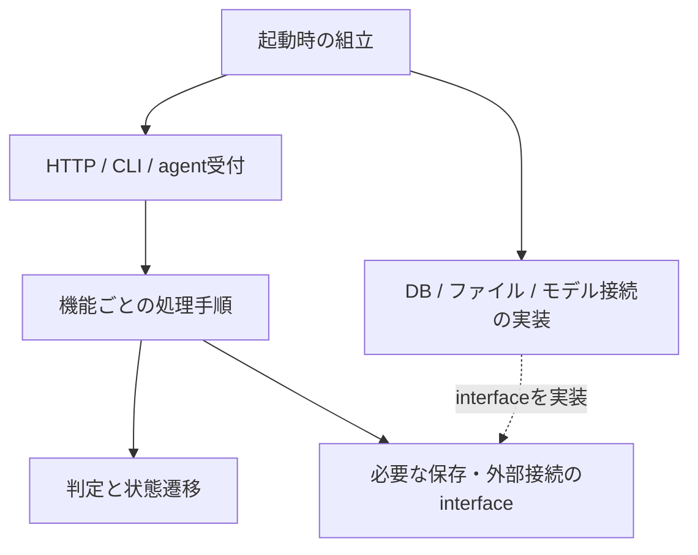

# リファクタリング計画書

> status: active | last-verified: 2026-09-08 | owner: project owner

最終更新: 2026-09-08（N6を受入し、N7の着手単位と既存UI残件を整理）

**現在地: N0〜N6のローカル実装・検証は完了。N7は未着手。TM-8は環境待ち、TM-9/TM-11は未着手。**
完了範囲と検証は[N0〜N2記録](../../archive/検証/リファクタリング_N0-N2_2026-09-08.md)と
[N3記録](../../archive/検証/リファクタリング_N3_2026-09-08.md)、
[N4記録](../../archive/検証/リファクタリング_N4_2026-09-08.md)、
[N5a記録](../../archive/検証/リファクタリング_N5a_2026-09-08.md)、
[N5b記録](../../archive/検証/リファクタリング_N5b_2026-09-08.md)、
[N6記録](../../archive/検証/リファクタリング_N6_2026-09-08.md)へ移した。
N0の契約固定は起動・画像一覧を対象とし、後続でも各処理の保存・失敗境界を着手前に固定する。
今回の受入はローカル実装・検証までであり、本番配備を含まない。

外部挙動を変えない内部構造改善の未完了事項と運用規則を管理する。
R0〜R7・D0〜D7 と R1 Windows実機受入の目的、変更内容、検証結果、完了時点の契約表は
[リファクタリング履歴](../../archive/リファクタリング履歴.md)と
[R0〜R7 契約表](../../archive/リファクタリング契約表_R0-R7.md)へ凍結した。

長期的な肥大化・設計ドリフトの予防策は
[品質ガードレール](../../design/詳細設計/品質ガードレール.md)、互換層・移行コード・
保守スクリプトの扱いは
[保守資産・互換層台帳](../../design/環境構築/保守資産・互換層台帳.md)を正本とする。

---

## 1. 管理先

| 判定 | 管理先 |
|---|---|
| ユーザーから見た振る舞いが増える・変わる | [バックログ](バックログ.md) |
| 外部挙動を変えない内部構造改善 | 本計画 |
| 依存・インフラ・性能特性を変更する | 本計画の「技術メンテナンス」 |
| 完了・スキップ・撤回済み | [リファクタリング履歴](../../archive/リファクタリング履歴.md) |

新機能、API・DBスキーマ・品質基準の仕様変更は本計画へ混在させない。
行数だけを理由にした分割、2箇所の類似だけを理由にした先回り共通化も行わない。

---

## 2. 技術メンテナンス

### TM-8. Mac評価CLIの実モデル回帰 — 環境待ち

- **現在地**: OS依存分離後の共通計算、モデル検証、read-only I/O、CLI引数はWindowsの回帰テストで
  確認済み。分離後コードによるMac実機のMLX推論だけは未確認である。
- **停止理由**: MLX専用venv、固定モデル、評価用SQLiteを利用できるMac環境がこの作業環境にない。
- **次の一手**: 対応Macで`export_novel_embeddings_mlx.py`と`eval_novel_reranker_mlx.py`を、
  [検索QA設計の比較手順](../../design/詳細設計/機能別/小説RAG_検索QA設計.md#rag-search-evaluation)に従って実行する。
- **完了条件**: 固定revision・入力SHA・runtime manifestを保存し、NPZ/report形式、検索指標、RSS単位、
  read-only DB契約が分離前の保存済み結果と一致すること。公開DBや既定backendは変更しない。
- **owner / 再評価条件**: project owner。対応Macを利用できる時点、またはMLX runtime・モデルrevision・
  評価CLIを変更するときに再開する。

Windows全体検査、CI指定Node.js 22.23.2のfrontend検査、文脈生成とpage全文索引の責務分離を含む
完了実績は[リファクタリング履歴](../../archive/リファクタリング履歴.md)、分離時の確認範囲は
[実施・検証記録](../../archive/検証/実装責務整理_2026-09-05.md)を参照する。

機能作業の優先順位は[バックログ「現在の優先順位」](バックログ.md#current-priorities)だけを正本とし、本書へ複写しない。

TM-2〜TM-7の契約、実測、完了確認は
[リファクタリング履歴](../../archive/リファクタリング履歴.md)へ移動済みである。

### TM-9. 起動・停止途中失敗時の資源回収 — 未着手

- **現在地**: N0の失敗注入で、watcher開始が失敗すると開始済みqueueの停止へ進まず、watcher停止が
  失敗するとqueue停止へ進まない既存の制御順を確認した。本番障害の発生を確認したという意味ではない。
- **判断**: N1は構造分離に限定し、この失敗時挙動を変更していない。cleanup保証の追加は別の技術メンテナンスとする。
- **次の一手**: 開始済み資源の記録、逆順cleanup、停止失敗時も残る資源の停止を試みる方針と、
  元の例外・cancel・timeoutの扱いを設計へ定義してから実装する。
- **完了条件**: 初期化・開始・稼働・停止の各失敗点で、未開始資源を停止せず、開始済み資源の回収を
  試みること。エラー原因を失わず、正常時の順序とjobの終了契約を維持すること。
- **owner / 再評価条件**: project owner。次に起動・停止処理を変更するとき、または次回配備の前に優先度を再評価する。
  N3の保存分離を直接ブロックする依存ではない。

---

### TM-11. 撮影補償そのものが失敗した場合の資産回収 — 未着手

- **現在地**: N5bの隔離DBへの失敗注入で、メタ復元が失敗すると後続のpackage/画像復元へ進まない既存挙動を確認した。本番障害の発生確認ではない。
- **判断**: N5bは責務移動に限定し、補償順・失敗範囲を維持する。複数補償失敗の扱いは別の技術メンテナンスとする。
- **次の一手**: 元の登録失敗と補償失敗の両方を保持し、残る資産の回収を試みる方針、再試行・手動復旧手順を設計する。
- **完了条件**: メタ・package・画像・退避世代の各復元失敗で残存資産が識別でき、成功済み補償を壊さず再開できること。
- **owner / 再評価条件**: project owner。撮影の補償処理を変更するとき、または次回配備の前に優先度を再評価する。

---

## 3. 未着手候補 — リファクタリング

### 3.1 ゼロから設計する場合の結論

現在の利用要件を引き継いで新規に作るなら、**機能ごとに状態と更新責任を閉じたモジュール型の
モノリス**を採る。Web backend、Windows撮影agent、OCR実行process、モデル提供processという
実行環境の境界は維持し、内部コードは「受付」「処理の順序と判定」「保存・外部接続」に分ける。
単一利用者という要件から、サービス数や採用技術を増やす必要性は現時点では認められない。

ここでいうゼロベースは、既存ファイルの並びではなく、利用者の操作と保存責任から構成を選ぶこと。
その設計を現行実装へ段階的に適用する。FastAPI、React/TypeScript、TanStack Query、SQLite、
LanceDB、uv workspaceを置換する判断は含めない。技術選定の更新が必要になれば別途比較する。

| 進め方 | 利点 | 負担・リスク | 本計画の判断 |
|---|---|---|---|
| 新しいアプリを一括再実装して切替 | 過去の配置制約なしに構成できる | 閲覧・撮影・OCR・公開・復旧の全契約を再実装し、データ移行と実機受入を同時に負う | 現時点では採らない |
| 現行入口を保ち、機能単位で内部を交換 | 既存テストと保存資産を使い、小単位で比較・復旧できる | 移行期間だけ旧入口と新内部が共存する | 推奨。互換入口の所有者と撤去条件を必ず管理する |
| 大きいファイルだけ分割 | 局所的に読みやすくなる | 状態や更新の所有者が曖昧なままファイル数だけ増える | 責務上の根拠がある箇所に限定する |

期待する効果は、変更対象を機能内へ絞ること、副作用なしで判定をテストできること、障害時に
どの資産が更新されたか説明できること。速度・開発工数の改善率は未測定であり、数値を約束しない。

### 3.2 現状の根拠と調査範囲

2026-09-08のローカル`master`、`d2e29d6`を基点に、要件・基本設計・backend/frontend設計、
主要な実装入口・更新処理・既存テストの所在・CI・依存境界検査を照合した。
全関数の監査、実モデル評価、稼働サーバーの確認、性能測定は今回の調査範囲外である。
以下は残存バグの断定ではなく、次の責務整理候補とその根拠である。

この表は計画策定時のsnapshotである。変更後の所有境界・比較値は
[N0〜N2受入記録](../../archive/検証/リファクタリング_N0-N2_2026-09-08.md)と
[N3受入記録](../../archive/検証/リファクタリング_N3_2026-09-08.md)、
[N4受入記録](../../archive/検証/リファクタリング_N4_2026-09-08.md)、
[N5a受入記録](../../archive/検証/リファクタリング_N5a_2026-09-08.md)、
[N5b受入記録](../../archive/検証/リファクタリング_N5b_2026-09-08.md)、
[N6受入記録](../../archive/検証/リファクタリング_N6_2026-09-08.md)を参照する。

| 観点 | 実装で確認した事実（リポジトリ相対パス） | ゼロベース設計との差・扱い |
|---|---|---|
| 起動と依存 | `backend/main.py`がDB初期化、migration、queue/watcherの開始・終了、route・静的配信を組み立てる | 組立箇所はある。設定・稼働資源を明示的に渡せる境界へ整え、テストやCLIの組立と分ける |
| Library HTTP | `backend/routers/library.py`の画像一覧がpath検証、列挙、自然順整列、URL生成を行う。書籍一覧にはthumbnailの遅延生成もある | HTTP変換と一覧取得を分ける候補。「一覧は副作用なし」と仮定せず、遅延生成とcache無効化を保存する |
| 生成と保存 | `backend/services/novel_db/full_builder.py`の`_run_combined_step`が既存結果取得、生成、人物検査、SQL置換、commit後の索引更新を扱う | 生成結果の検査と更新の順序を明示し、SQLを所有する処理へ委譲する。文脈生成の再分割は不要 |
| 検索 | `backend/services/novel_db/search.py`がFTS/vector検索と結果統合に加え、snippetや画像URLを扱う | 検索の判定とAPI向け整形の分離を検討する。page全文索引のstate/builder/query分離は完了済み |
| OCR実行 | `job_worker.py`→`job_executor.py`→`ocr_job_application.py`に実行経路があり、`OcrJobDependencies`で依存を注入している | 既存の分離を再利用する。application側に残るconfigや具体engine revision参照が組立側へ出せるか確認する |
| 撮影公開 | `backend/services/kindle_catalog/capture_registration.py`が検証・配置・メタ更新・job確定を順序制御し、`capture_publication.py`が逆順補償する | すでにworkflowと保存処理の境界がある。既存補償を維持し、他機能の保存入口を直接知る範囲だけ絞る |
| Frontend状態 | `ViewerPage.tsx`がURLをlibrary storeへ同期し、`hooks/reader/useReaderState.ts`が専門hookと書籍切替時のeffect順序を集約する | 専門hookの分割は済んでいる。URL・server state・読書session・一時UIの所有を固定してから公開interfaceを絞る |
| Frontend配置 | Kindle/OCRは`features/`内に画面とAPIがあり、Library/Readerは`components/`・`hooks/`・`features/`へ分散する | 機能を辿る入口を揃える余地がある。画面の一括移動から始めない |
| 検査 | `check_import_boundaries.py`はservice→router等と既知の互換入口利用を検査する | 新しい機能間依存と内部実装への直接importは、対象を決めて検査を追加する。現行検査が新配置も覆うとは仮定しない |

R0〜R7、D0〜D7、Windows/Node検査正常化、Dialog・アクセシビリティ修正、文脈生成・page全文索引分離は
完了済みの基盤として利用する。同じ作業を新たな未完了項目として計上しない。

### 3.3 目標とする責務・データ所有

以下は**将来案**であり、現行設計の正本を上書きしない。採用する単位ごとに実装前に関連設計と
必要なADRへ反映する。小さい機能まで一律にclass・repository・interfaceを増やさない。

| 機能境界 | 所有する状態・判断 | 他機能へ渡すもの |
|---|---|---|
| Library | source内の書籍参照、画像/PDF操作、書誌・既読・表示設定。既存`meta2.db`とファイルの更新入口 | 書籍参照と閲覧用read model、メタ更新操作 |
| Kindle catalog | 購入書誌、ASINとの関連付け、取込・価格監視。既存`kindle_catalog.db`の担当テーブル | 撮影対象情報と関連付け操作 |
| Capture | agentのclaim/heartbeat、manifest検証、画像配置とjob確定の調整 | 検証済み撮影結果。Libraryのメタ更新はその公開入口を経由 |
| Novel OCR | 原候補、採用本文、QA、公開世代とprovenance。既存`novel.db`の担当テーブル | 公開済み本文の参照。候補生成の成功と公開承認を分ける |
| Novel generation | 要約・人物・文脈の生成、検査、保存順序 | 検証済み生成結果。QwenとSolの実行・評価・公開契約は別々に維持 |
| Novel retrieval | 本文・要約などの検索と派生索引、scope・順位決定 | 順位と出典を持つ検索結果。API用URL/表示整形は境界で行う |
| QA / discussion | 会話session、出典付き回答、SSEイベントの順序 | 検索・生成の公開操作を呼び出す。隣接機能の内部SQLへ依存しない |
| 実行・連携基盤 | queueの起動終了、process/HTTP接続、時刻・設定の供給 | 用途別の狭い接続interface。全jobを共通の状態機械へ統合しない |

`book_id`、ASIN、`book_name`、OCR run ID、capture job IDは意味が違う。単一の「Book」モデルへ
統合せず、現行の対応規則とsourceを型・変換入口で表す。DBの物理分割・統合やID再採番は行わない。

同じSQLite上に複数機能があっても、更新の所有者は一つにする。複数テーブルを一緒に確定する操作は
上位の処理がtransactionを所有し、下位の保存関数が勝手にcommitしない構成を目指す。ただし移行時は
**現行のcommit/rollback位置を先に固定し、変更を伴う最適化は分離する**。
SQLite・画像ファイル・LanceDB全体を単一transactionとして扱わず、現行の補償・再構築手順を保つ。



処理手順と判定はFastAPI・React・具体モデルruntimeに依存させない。interfaceは副作用の
差し替えが必要な境界だけに置く。既存の関数引数・dataclass・Protocolを優先し、DI frameworkは導入しない。
frontendではURLを場所、TanStack Queryをserver state、読書sessionをページ移動と書籍切替、
local stateをDialog等の一時UIの所有者とする。既存store/contextを残し、同じ値の書込み元を増やさない。

### 3.4 ファイル配置案と移動方針

ゼロからなら機能内でAPI操作・状態・表示・保存の関係が辿れる配置を選ぶ。下記は最終形の案であり、
未作成ディレクトリを含む。`bootstrap/`のruntimeと`services/library/`の画像一覧だけはN1/N2で作成済み。
全域の一括renameや、空の階層だけの追加は行わない。

```text
backend/
  main.py                    # 既存の main:app 入口を維持
  bootstrap/                 # 起動終了は分離済み。設定・具体資源の組立はmainに残す
  routers/                   # HTTP/SSE と公開schema
  services/
    library/                 # 閲覧資産・メタ操作（既存平置きから順次）
    kindle_catalog/          # 購入書誌・関連付け
    capture/                 # 撮影jobと公開の調整（独立の効果を検証後）
    novel_db/
      ocr/                   # 候補・QA・公開
      generation/            # 要約・人物・文脈
      retrieval/             # 検索・索引
      conversation/          # QA・discussion
      jobs/                  # job状態と実行調整
  config/                    # 設定の型と読込み
frontend/src/
  pages/                     # URLと機能画面の組立
  features/<feature>/        # api・query・model/hook・機能内表示
  components/ui/             # 共通Dialogなど
  lib/                       # HTTP/SSE等の共通接続
kindle-pdf/                  # Windows操作・撮影。backend内部をimportしない
common/llm/                 # 共通のモデル接続。業務の公開判断を持たない
```

backendの保存adapterは各機能内に置き、汎用repositoryへ全SQLを集約しない。`services/`に残す
小さな既存機能、`utils/`など既存共通資産は必要なものを維持する。`novel_db`配下の分割も、
共用connection/migrationと複数領域を調整する処理の所有者を決めた後に行う。
frontendの移動先は`features/library`・`features/reader`等を候補とし、採用時に現行のfrontend規約と
設計を同時に更新する。依存検査の走査範囲を先に保証し、自動ファイルマップは生成手順で更新する。

### 3.5 段階計画と依存順序

新計画はN系列で区別する。**N7は未着手**。N0〜N6は受入記録へ移動済み。
ownerはproject owner、設計判断・統合・最終検証はメイン担当が行う。
各段階はさらに独立して検査が通る小単位へ分け、前段の受入後に次の範囲を確定する。

| 段階 | 実施内容・主な所有範囲 | 受入条件 | 依存・優先度 |
|---|---|---|---|
| N7 | 効果を確認した境界に限り残る物理配置を整理。`novel_db`の機能package化、移行入口整理、運用CLIの参照更新、依存検査とfile map更新 | 新たな循環・機能内部への越境importなし。旧公開入口は維持または台帳の撤去条件を充足。全検査と関連環境受入、復旧手順を記録 | N1〜N6の対象受入後。機械的移動と内部変更は別commit |

残るN系列はN7。N6では画面入口とlifecycleだけを集約し、既存のcomponent・専門hookを維持した。
TM-8はMac評価CLIの環境待ちであり、N7の独立した範囲の調査を妨げない。
N7の互換入口撤去が未確認環境に依存する場合は、その小単位だけを保留する。

N7は「すべてのファイルを動かす」完了条件にしない。N1/N2では注入可能な起動順と、HTTPから独立して
検査できる画像metadata取得を得たが、変更速度や工数の改善は未測定である。
後続でも効果を個別に確認し、新階層の全域展開を自動承認しない。未調査の全域へ固定日程を置かない。

### 3.6 固定する契約と検証

契約の意味は[品質ガードレール](../../design/詳細設計/品質ガードレール.md)と
[ドキュメント案内の正本マップ](../../index.md#canonical-map)を参照する。
N0で採った方法を各段階にも適用し、次の比較対象を実行可能なtest/fixtureへ対応付け、未網羅の境界だけ補う。

| 境界 | 固定・比較する内容 | 既存の足場・追加観点 |
|---|---|---|
| HTTP / import / CLI | OpenAPI、status/error、既定値、公開import、CLI引数・exit code、静的URL | `check_openapi_contract.py`、router/CLI test。schemaに出ないerrorも比較する |
| 起動・job | 初期化順、claim、進捗、終了・再開・cancel、SSE event/data/順序 | `test_main.py`、`test_novel_db_job_queue.py`、worker/agent test。正確な時刻や推論所要時間は一致対象にしない |
| 保存・生成 | schema/head、更新行、commit/rollback、派生索引の更新と失敗後の状態 | full_builder/context/page FTS test、isolated DB・一時画像と障害注入。成功時だけで判断しない |
| 撮影 / OCR | source、manifest/SHA、候補と公開の分離、既存資産保持、補償 | capture rollback、OCR publication/QA/worker test。実機受入に本番公開操作を含めない |
| 検索 / AI | scope、順位、出典、選択規則、prompt・runtime・既定engine | `test_novel_db_search.py`等。固定生成結果で制御を検証し、確率的な実モデル出力一致を要求しない |
| Frontend | URLとquery key、書籍切替のeffect順序、閲覧・編集・選択・保存対象 | `useReaderState.test.ts`/`useUrlState.test.tsx`等と実ブラウザ。画面上の選択と送信先の一致も確認する |

実装と正本が食い違った場合は、不具合を仕様として固定する前に差分を記録し、修正を別の変更として判断する。
本番DB・原画像を直接fixtureにせず、一時保存先と合成・許可済みの固定入力を使う。
正式OCR holdoutをリファクタの反復試験に流用しない。実モデル・Windows撮影・Mac MLXが必要な
受入は環境と確認範囲を明示し、未実施ならその小単位を完了扱いにしない。

検証コマンドは現行CIを基準にする。対象テストを先に実施し、変更した小単位の最終版で関連する
全体検査を行う。N0〜N2で実行した範囲と結果は受入記録を参照し、後続へそのまま合格を引き継がない。

| 場所 | 検証コマンド |
|---|---|
| root（全体の構造検査） | `uv run python scripts/maintenance/monthly_health_audit.py` |
| root（docs） | `uv run python scripts/maintenance/check_docs.py` / `uv run python scripts/maintenance/generate_file_map.py --check` |
| root（docs build） | `uvx --with mkdocs-material --with mkdocs-mermaid2-plugin mkdocs build --strict` |
| backend | `uv run ruff check .` / `uv run ruff format --check .` / `uv run basedpyright` / `uv run pytest -q --cov --cov-fail-under=65` |
| kindle-pdf / common/llm（各directory） | `uv run pytest -q` |
| frontend（Node.js 22.23.2 / npm 10.9.8） | `npm run lint` / `npm run lint:deps` / `npm run test:ci` / `npm run build` |

依存導入・監査の再現性と最新のCI実行項目は`.github/workflows/ci.yml`を正本とする。
baseline悪化の許容、テスト期待値の一括更新、coverage閾値の低下で構造変更を通さない。
各段階の着手時に越境import・公開入口・対象操作で触れるmodule・外部依存を記録し、各移行で同じ定義で比較する。
ファイル総数や総行数の減少は受入条件にしない。

### 3.7 次に着手する単位と復旧

次の単位は**N7a: 残る配置候補と公開入口の参照調査**とする。

1. N0〜N6を区切り、`novel_db`、互換入口、運用CLIのproduction/test/外部利用を調査する。
   `features/library` / `features/reader`への入口整理を全域移動の根拠にしない。
2. package化・互換入口撤去・CLI参照更新を別単位にし、移動により改善する依存境界と
   残す入口、復旧手順をファイル単位で確定する。効果が示せない移動は見送る。
3. N7b以降は承認された小単位で機械的移動 → import/循環・契約検査 → file map・台帳更新を
   行う。内部ロジック変更を同じcommitへ混在させない。外部実行環境が必要な単位だけ保留する。
4. N6はWindows Chromiumのdesktop/390pxと隔離APIで既存動作を比較した。
   既存のモバイルReaderヘッダーはみ出しは[バックログ B-38](バックログ.md#b-38)で扱う。
   本番サービス接続・実データ更新・実端末タッチの追加受入を完了扱いにしない。

N5a/N5bのローカル受入は完了した。N5bで固定したメタ復元失敗時の後続補償停止は
TM-11で別途扱い、N6へ混在させない。実モデル・実撮影の受入を追加完了として扱わず、詳細は
[N5a受入記録](../../archive/検証/リファクタリング_N5a_2026-09-08.md)と
[N5b受入記録](../../archive/検証/リファクタリング_N5b_2026-09-08.md)を参照する。

N3/N4で確認した、SQLite公開済みでも索引が古い・欠落し得る境界は維持する。通常再実行による
自動修復は既存契約に含まれず、その追加は別の変更として判断する。

移行中も書込み経路は一つとし、旧実装と新実装の二重書込みはしない。各変更は既存入口を保ち、
異常時はその変更をrevertして戻せる範囲に限定する。コードのrevertで更新済みデータまで戻るとはみなさず、
保存系は既存backup/rollbackを隔離環境で検証する。復旧に新migrationや公開データ再作成が必要なら
本計画の範囲を止めて再計画する。
完了したN項目の実績は同じ変更で履歴へ移し、本書では次の未完了項目と残る依存だけを更新する。

## 4. 対象外

個人LAN・単一利用者という現行前提では、通常閲覧APIの利用者別認証、rate limit、API versioning、
microservices、マルチテナント化を内部改善として起票しない。前提が変わる場合は、必要な利用者体験と
移行契約を[バックログ](バックログ.md)または新しい設計判断へ先に記録する。

## 5. 共通の完了条件

1. 変更前にcharacterization testまたは比較fixtureを用意する。
2. 公開import、API、DB、SSE、保存ファイル、error codeの不変条件を明記する。
3. 設計書、変更履歴、ソース、テストの順で変更する。
4. 対象テストの後に全体テスト、月次監査、静的検査を行う。
5. UI影響がある場合はdesktop/mobile、keyboard、console、修正後再実行を確認する。
6. rollback可能な単位でcommitし、仕様変更・依存更新・性能改善を混在させない。
7. 完了実績は同じ変更で履歴へ移し、本書には未完了事項だけを残す。
8. 例外や保留にはowner、理由、期限、再評価条件を記録する。

### 中止・再計画条件

- OpenAPI、DB migration、SSE、manifest、OCR判定に意図しない差分が出た。
- 現行挙動を固定できない副作用が見つかった。
- 新機能またはデータ移行が不可避になった。
- 独立したgreen状態を作れないまま変更範囲が拡大した。

---

## 関連ドキュメント

- [品質ガードレール](../../design/詳細設計/品質ガードレール.md)
- [保守資産・互換層台帳](../../design/環境構築/保守資産・互換層台帳.md)
- [リファクタリング履歴](../../archive/リファクタリング履歴.md)
- [R0〜R7 契約表](../../archive/リファクタリング契約表_R0-R7.md)
- [バックログ](バックログ.md)
- [変更履歴](../変更履歴.md)
